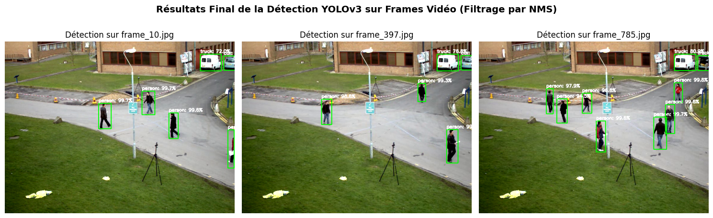
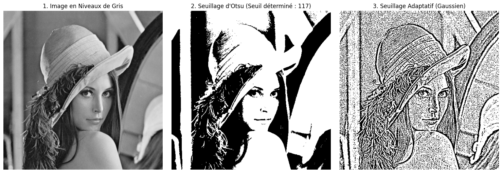
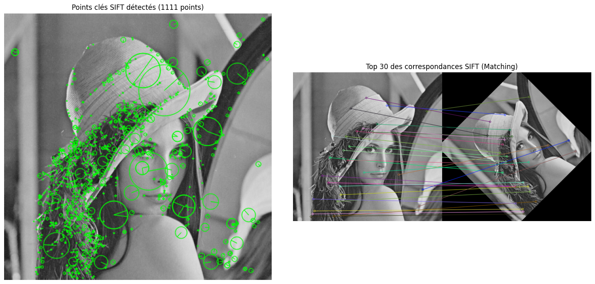
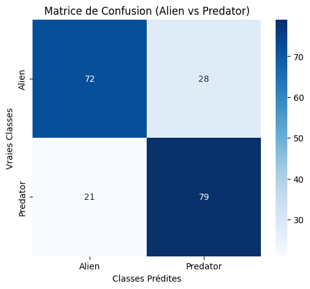
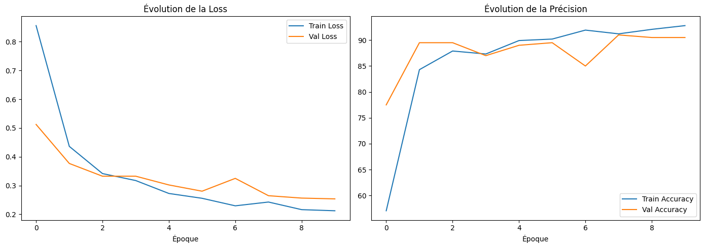
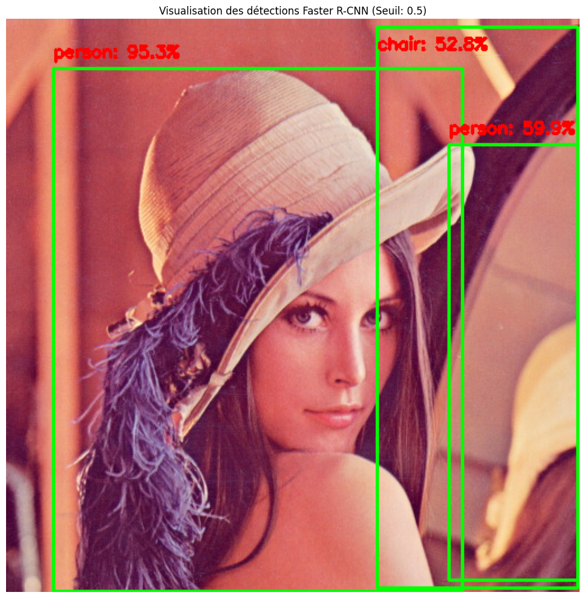
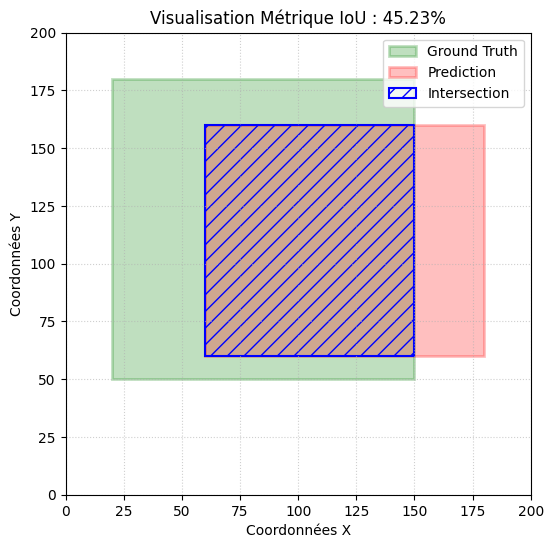

# 👁️ Vision par ordinateur : des descripteurs classiques au deep learning

> Étude de cas du module « Détection et reconnaissance d'objets », Master Data & IA, Nexa Digital School (juin 2026).
> Parcourir toute la chaîne de la vision par ordinateur : traitement d'image classique, classification par réseau de neurones, puis détection d'objets.



## Résultats clés

| Approche | Résultat |
|---|---|
| 🧠 CNN conçu de zéro (PyTorch) | **76 %** de bonnes réponses sur Alien vs Predator |
| 🚀 Transfer learning ResNet-18 | **90,5 %**, soit **+14,5 points**, avec le même nombre d'époques |
| ⚡ YOLOv3 vs Faster R-CNN | YOLOv3 **12 fois plus rapide** (0,87 s contre 10,4 s) |
| 🔍 SIFT | Retrouve les mêmes points malgré une rotation de 45° et une réduction de 25 % |

**À retenir** : sur un petit jeu de données (894 images), réutiliser un modèle pré-entraîné est bien plus efficace que de tout entraîner soi-même.

## Démarche

### 1. Traitement d'image classique (OpenCV)
Lecture, redimensionnement, histogrammes, seuillage d'Otsu et seuillage adaptatif.

### 2. Descripteurs de caractéristiques
- **HOG** (scikit-image) : description des contours et de leur orientation.
- **SIFT** (OpenCV) : points caractéristiques robustes aux rotations et aux changements d'échelle.

| Seuillage | Correspondances SIFT |
|---|---|
|  |  |

### 3. Classification Alien vs Predator
- **CNN conçu de zéro** avec PyTorch : 5 couches de convolution, BatchNorm, Dropout 0,5, 10 époques. 694 images d'entraînement et 200 de validation.
- **Transfer learning** avec **ResNet-18** pré-entraîné sur ImageNet : couches gelées, seule la dernière couche est réentraînée.

| Matrice de confusion du CNN | Courbes d'apprentissage ResNet-18 |
|---|---|
|  |  |

### 4. Détection d'objets
- **Faster R-CNN** (ResNet-50 FPN, pré-entraîné sur COCO), avec PyTorch : précis, en deux étapes.
- **YOLOv3**, avec le module DNN d'OpenCV : un seul passage, donc adapté au temps réel. Filtrage des boîtes en double par NMS.
- **Application sur une vidéo** de scène urbaine (795 images) : détection des piétons et des véhicules sur des images extraites.

| Faster R-CNN | Évaluation par IoU |
|---|---|
|  |  |

### 5. Évaluation et optimisation
- **IoU** (Intersection over Union) pour mesurer la qualité d'une boîte de détection.
- **Pipeline d'augmentation de données** : retournements, rotations, zooms, variations de luminosité et de contraste (couches Keras), pour enrichir un petit jeu d’images.

## Structure du dépôt

```
├── notebooks/
│   └── vision_par_ordinateur.ipynb   # tout le code, avec les résultats
├── images/                           # 16 figures exportées du notebook
└── requirements.txt
```

## Lancer le projet

Le plus simple : ouvrir le notebook dans **Google Colab** avec un GPU, puis exécuter les cellules dans l'ordre. Le notebook télécharge automatiquement tout ce dont il a besoin :
- le jeu **Alien vs Predator** via `kagglehub` ([source Kaggle](https://www.kaggle.com/datasets/pmigdal/alien-vs-predator-images)) ;
- les poids et la configuration de **YOLOv3** ;
- la vidéo d'exemple d'OpenCV.

En local :

```bash
pip install -r requirements.txt
jupyter notebook notebooks/vision_par_ordinateur.ipynb
```

## Stack

Python · OpenCV · scikit-image · PyTorch · torchvision · TensorFlow (chargement des données) · Matplotlib · Google Colab

## Pistes d'amélioration

- Entraîner le CNN et ResNet-18 **avec** l'augmentation de données pour mesurer son effet réel.
- Dégeler les dernières couches de ResNet-18 (fine-tuning) pour gagner encore en précision.
- Appliquer YOLO sur toutes les images de la vidéo et mesurer le nombre d'images traitées par seconde.

---

👩‍💻 **Nosaiba Elkrekshi** · Master 2 Data & IA · [LinkedIn](https://www.linkedin.com/in/nosaiba-elkrekshi) · nosaiba.elkrekshi@gmail.com
